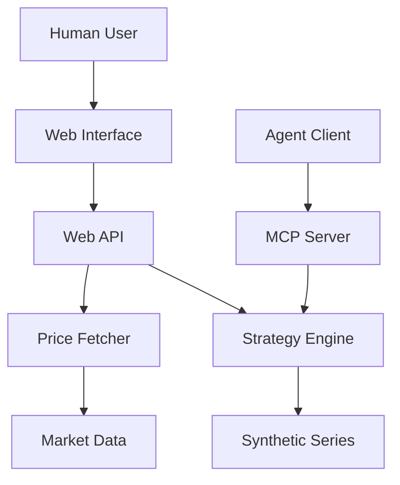

# Designing an MCP-Ready Strategy Lab

When you build a quantitative strategy lab that needs to serve both humans and agents, the architecture has to stay simple and predictable. This system does that by treating the MCP server as a first-class interface alongside the web UI, while keeping the overall layout clean: a single strategy engine, a thin interface layer, and optional market data retrieval.

This article focuses on the MCP server architecture and how it fits into the broader system, without diving into implementation details.

## Architecture Diagram

## A Three‑Layer Mental Model

The architecture can be thought of in three layers:

1. Core logic: the strategy engine that produces signals, runs backtests, and computes metrics.
2. Interfaces: MCP tools for agents, plus a web interface for humans.
3. Data sources: optional market data feeds and synthetic series for demos or offline use.

The MCP server sits in the interface layer. Its responsibility is not to “do the math” itself, but to expose the engine’s capabilities as tools with clear inputs and outputs.

## The MCP Server as a Stable Contract

The MCP server is designed around a small set of well‑defined tools:

- List available strategies and their parameters.
- Fetch a strategy schema for UI or client setup.
- Generate a synthetic price series for quick experiments.
- Run a backtest and return structured results.

These tools establish a stable contract for any client. Whether the caller is a chat agent, a notebook, or another service, the interface remains the same. This reduces coupling and keeps the engine free to evolve internally without breaking clients.

## Why the MCP Server Is Thin by Design

A strong design choice here is to keep the MCP server “thin.” It delegates all domain logic to the strategy engine, and focuses on:

- Input validation: preventing malformed or unsafe requests.
- Normalization: ensuring consistent inputs across clients.
- Output shaping: returning structured, predictable payloads.

By avoiding business logic in the server layer, the system keeps one source of truth for strategy behavior and analytics. That makes debugging easier and upgrades less risky.

## How It Fits Into the Overall System

The MCP server is not the only interface. The architecture intentionally supports a web UI that uses the same underlying engine. This creates two parallel entry points:

- Human‑centric interaction through the web interface.
- Agent‑centric interaction through MCP tools.

Both paths lead to the same engine. Given the same prices and parameters, a backtest run via MCP matches one run in the browser. This is the architectural “anchor” that keeps the system coherent.

## Data Strategy: Real vs Synthetic

The system supports two types of price data:

1. Real market data fetched on demand.
2. Synthetic data for fast demos and offline use.

In this architecture, real market data is fetched through the web API path, while the MCP server does not reach out to external data sources. This matters for MCP architecture because it keeps tools usable even when data sources are unavailable. The MCP server remains data-source agnostic: clients can supply prices directly or call the synthetic series tool for a ready-made input, enabling deterministic testing and reproducible experiments.

## Scaling the MCP Layer

Because the MCP server is small and stateless, it scales naturally:

- Add new strategies without changing the contract shape.
- Add new analytics without expanding the interface footprint.
- Support multiple clients with minimal coordination.

If you want to expand the system, the server remains stable while the strategy engine grows. That’s a deliberate separation of concerns, and it keeps the MCP surface area compact.

## The Core Architectural Advantage

This setup provides a clear advantage: clients interact with a consistent tool set, while the internal engine can evolve independently. The MCP server is a contract, not a computation engine. That small distinction makes the system easier to test, easier to document, and easier to extend.

In short: the MCP server gives the architecture a stable spine. Everything else — UI, data sources, strategy internals — can change without breaking that spine.

## Final Takeaway

An MCP‑first strategy lab succeeds when the server stays small, predictable, and contract‑driven. By separating interfaces from strategy logic and keeping data optional, this architecture balances flexibility with stability. It is lean enough to understand at a glance, yet strong enough to power multiple clients with identical behavior.