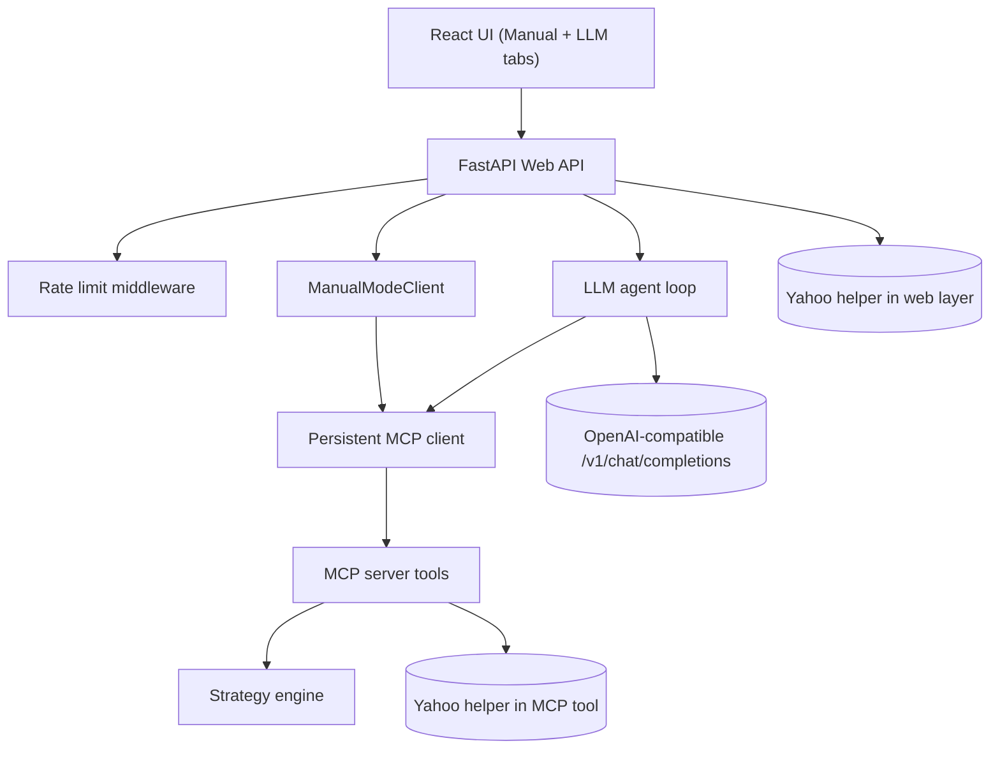

# Quant Strategy Lab Architecture

This document reflects the current architecture implemented in:

- `src/mcp_quant/strategies.py`
- `src/mcp_quant/mcp_server.py`
- `src/mcp_quant/mcp_client.py`
- `src/mcp_quant/manual_client.py`
- `src/mcp_quant/llm_agent.py`
- `src/mcp_quant/data.py`
- `src/mcp_quant/web/app.py`

## System Diagram

## Layer Model

1. Core engine: strategy definitions, signal generation, backtesting, and metrics in `strategies.py`.
2. Interface layer: MCP tools in `mcp_server.py`, plus HTTP endpoints in `web/app.py`.
3. Data layer: synthetic prices from `sample_price_series` and real prices from Yahoo Finance.
4. Orchestration layer: optional LLM tool selection in `llm_agent.py`.

## MCP Tool Contract

The MCP server exposes five tools:

- `list_strategies`
- `get_strategy_schema`
- `sample_price_series`
- `fetch_yahoo_prices`
- `run_backtest`

The server is intentionally thin:

- Delegates strategy and backtest math to `strategies.py`.
- Normalizes date/range inputs for Yahoo fetch.
- Returns structured payloads for stable client integration.

## Runtime Request Paths

### Manual Mode path (`/api/backtest`)

1. If `ticker`, `start_date`, and `end_date` are present, FastAPI fetches Yahoo prices directly via `data.fetch_yahoo_prices`.
2. Otherwise, FastAPI requests synthetic prices via MCP tool `sample_price_series`.
3. FastAPI runs the backtest via MCP tool `run_backtest`.
4. Response returns prices, signals, equity curve, positions, trades, and metrics.

### LLM Mode path (`/api/agent`)

1. FastAPI calls `run_llm_agent`.
2. The agent calls an OpenAI-compatible chat completion endpoint.
3. The model selects MCP tools (for example `fetch_yahoo_prices`, `list_strategies`, `run_backtest`).
4. The agent executes MCP calls through the same persistent MCP client and returns the tool trace.

## Client Transport and Lifecycle

- Startup: `web/app.py` opens one MCP client connection on app startup.
- Shutdown: the connection is closed on app shutdown.
- Default transport: stdio, spawning `python -m mcp_quant.mcp_server`.
- Optional transport: SSE when `MCP_SERVER_URL` is set and SSE support is installed.
- Resilience: `mcp_client.py` includes timeout, health tracking, retry, and exponential backoff behavior.

## Web API Surface

The FastAPI app exposes:

- `GET /api/strategies`
- `POST /api/backtest`
- `POST /api/agent`
- `GET /api/rate-limit-status`

Root (`/`) serves the React shell, and `/static/*` serves static assets.

## Cross-Cutting Concerns

- Input validation:
  - Pydantic request models in `web/app.py`.
  - Strategy/price validation in `strategies.py`.
  - Additional reusable validators in `validation.py`.
- Rate limiting:
  - In-memory per-IP limits (30 requests/minute, 300 requests/hour).
  - Applied to API routes; static assets and `/` are excluded.
- Error mapping:
  - MCP failures map to HTTP 502.
  - Data source connectivity failures map to HTTP 503.
  - Invalid user input maps to HTTP 400/422.

## Intentional Design Choices

- Thin MCP server: keeps tool contract stable while strategy internals evolve.
- Shared core engine: both Manual and LLM flows converge on the same backtest logic.
- Dual Yahoo access path is intentional:
  - Direct web-layer fetch supports straightforward human-driven runs.
  - MCP tool fetch supports LLM-driven multi-step workflows.

This keeps the architecture predictable while supporting both deterministic manual runs and agentic tool orchestration.
