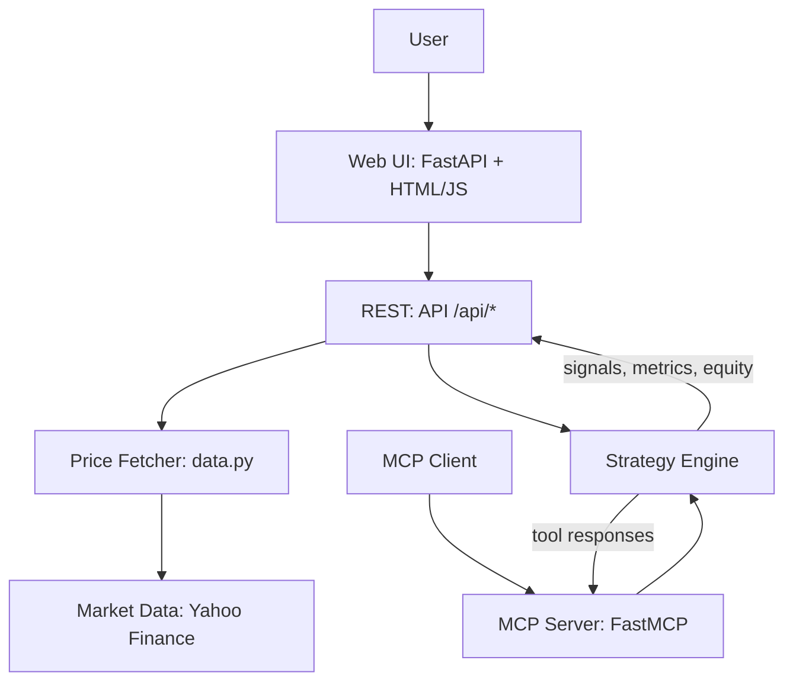

# Architecture Diagram

## Notes

- The Strategy Engine in `src/mcp_quant/strategies.py` is shared by the MCP server and the web UI.
- The web UI is served by FastAPI in `src/mcp_quant/web/app.py` and calls JSON endpoints.
- The MCP server in `src/mcp_quant/mcp_server.py` exposes tools for strategies and backtests.
- Yahoo Finance data is pulled by `src/mcp_quant/data.py` when the API receives a ticker and date range.
