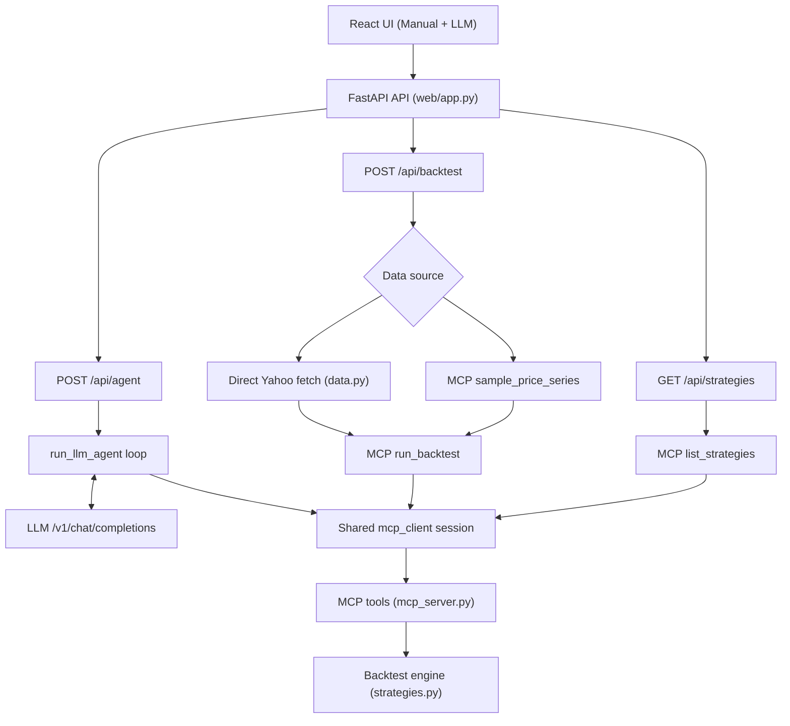

# Quant Strategy Lab Architecture

This document describes the current runtime architecture implemented in:

- `src/mcp_quant/web/app.py`
- `src/mcp_quant/web/static/app.jsx`
- `src/mcp_quant/manual_client.py`
- `src/mcp_quant/mcp_client.py`
- `src/mcp_quant/mcp_server.py`
- `src/mcp_quant/llm_agent.py`
- `src/mcp_quant/data.py`
- `src/mcp_quant/strategies.py`

## Design Summary

- One execution contract: strategy execution runs through MCP `run_backtest`.
- Two interaction modes: Manual mode (`/api/backtest`) and LLM mode (`/api/agent`).
- One shared MCP session: both modes use the same in-process `mcp_client`.
- One strategy engine: signal generation and performance logic live in `strategies.py`.

## Runtime Diagram

## Component Responsibilities

- `web/app.py`: HTTP surface, request validation, rate limiting, MCP lifecycle, and error mapping.
- `web/static/app.jsx`: Manual and LLM tabs, request payloads, and chart/metrics rendering.
- `manual_client.py`: thin async wrappers for manual mode MCP calls.
- `mcp_client.py`: transport/session management, retries, backoff, and tool-call execution.
- `mcp_server.py`: tool contract for strategy discovery, price sourcing, and backtest execution.
- `llm_agent.py`: tool-calling loop, strategy name normalization, and terminal response behavior.
- `strategies.py`: strategy catalog, signal generation, backtest loop, and metrics.

## Request Flows

### Manual mode (`POST /api/backtest`)

1. `BacktestRequest` validates strategy, params, ticker/date format, and numeric ranges.
2. API selects data source:
   - direct Yahoo fetch via `fetch_yahoo_prices(...)`, or
   - synthetic series via MCP `sample_price_series`.
3. API executes MCP `run_backtest` through `manual_client.run_backtest`.
4. Response returns `prices`, `signals`, `equity_curve`, `positions`, `trades`, and `metrics`.

### LLM mode (`POST /api/agent`)

1. API calls `run_llm_agent(...)`.
2. Agent sends messages to an OpenAI-compatible `/v1/chat/completions` endpoint.
3. Agent parses JSON output into either:
   - `{"tool": ..., "arguments": ...}`, or
   - `{"final": ...}`.
4. Tool calls execute via `mcp_client.call_mcp_tool(...)`.
5. Non-terminal tool results are fed back into the loop.
6. If `run_backtest` is executed, the agent returns immediately with tool steps and final status.

## MCP Tool Contract

Current tools in `mcp_server.py`:

- `list_strategies`
- `get_strategy_schema`
- `sample_price_series`
- `fetch_yahoo_prices`
- `run_backtest`

`run_backtest` delegates execution to:

- `validate_prices`
- `generate_signals`
- `backtest`

This keeps MCP focused on orchestration and contract boundaries while strategy internals stay in `strategies.py`.

## UI Behavior

- Charts update only after clicking `Run backtest`.
- After a successful run, the corresponding run button is disabled.
- Editing inputs re-enables the run button.
- Input changes do not auto-run or auto-refresh charts.

## Operational Notes

- MCP connection opens at FastAPI startup and closes at shutdown.
- Default MCP transport is stdio (`python -m mcp_quant.mcp_server`).
- If `MCP_SERVER_URL` is set and SSE support is available, transport can switch to SSE.
- API rate limiting is enabled: `30/minute` and `300/hour` per IP.

Error mapping in the API layer:

- MCP failures: `502`
- LLM response failures: `502`
- LLM config failures: `503`
- Yahoo connection/timeouts: `503`
- Yahoo value errors: `400`
- Request schema/validation errors: `422`
