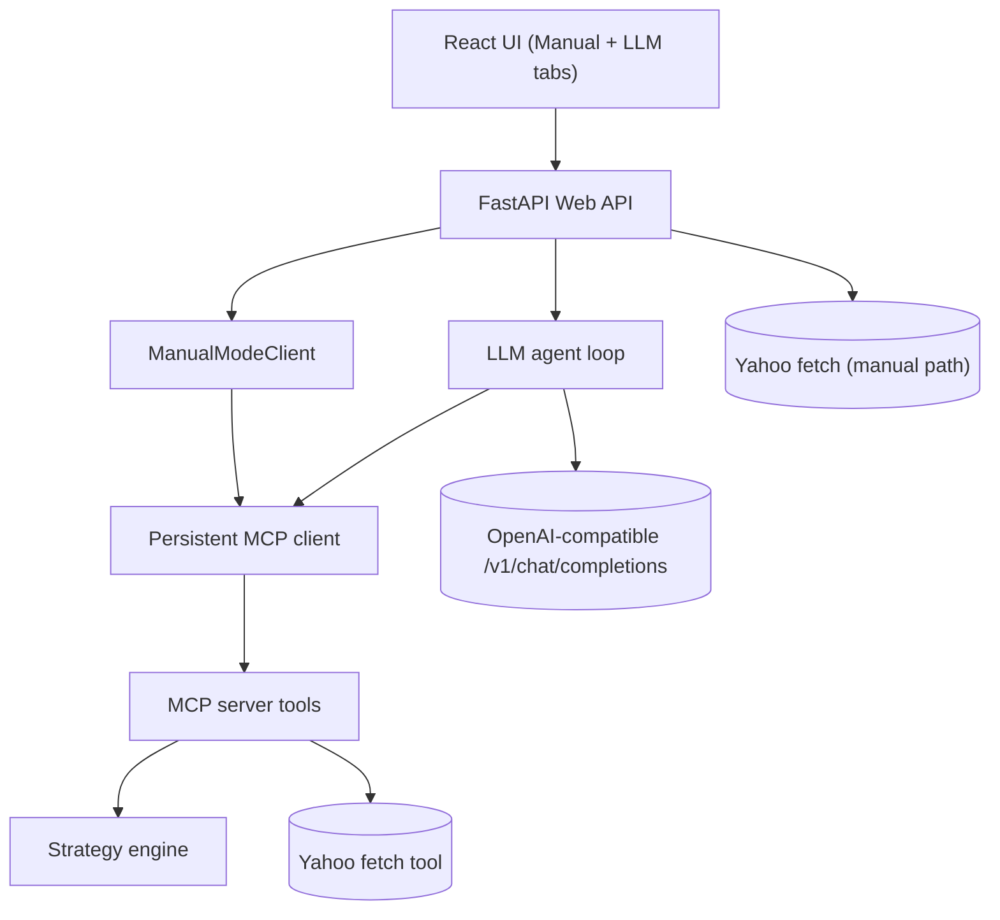

# Building an MCP-First Quant Strategy Lab for Analysts and AI Agents

Many MCP-based applications are built mainly for agentic workflows. I wanted a single system that supports analysts through a UI and LLM agents through tool calls, without duplicating execution logic.

The design rule is simple: all strategy execution goes through the MCP server contract.

## Why This Matters

The MCP server is the center of the architecture:

- It exposes a stable tool interface.
- It keeps strategy math in one place (the engine).
- It keeps manual and agentic workflows behaviorally consistent.

This reduces drift between interfaces and makes changes safer.

## System Components

1. MCP server: `src/mcp_quant/mcp_server.py`
2. Strategy engine: `src/mcp_quant/strategies.py`
3. FastAPI app: `src/mcp_quant/web/app.py`
4. LLM loop: `src/mcp_quant/llm_agent.py`

Built-in strategies:

- `sma_crossover`
- `rsi_reversion`
- `channel_breakout`

## Architecture Diagram

Note: Medium does not render Mermaid natively. Export this as PNG/SVG before publishing.



## MCP Tool Surface

- `list_strategies`
- `get_strategy_schema`
- `sample_price_series`
- `fetch_yahoo_prices`
- `run_backtest`

MCP `run_backtest` stays thin and delegates to core engine functions:

```python
@mcp.tool()
def run_backtest(prices, strategy, params=None, start_cash=10_000.0, fee_bps=1.0):
    cleaned = validate_prices(prices)
    signals = generate_signals(cleaned, strategy, params)
    result = backtest(cleaned, signals, start_cash=start_cash, fee_bps=fee_bps)
    return {"prices": cleaned, "signals": signals, **result}
```

## Two Entry Points, One Contract

### Manual Mode (`POST /api/backtest`)

1. If ticker + date range are provided, Yahoo prices are fetched in the web layer.
2. Otherwise, synthetic prices come from MCP `sample_price_series`.
3. Backtest execution runs through MCP `run_backtest`.

### LLM Mode (`POST /api/agent`)

1. The model emits tool actions as JSON.
2. Backend executes MCP tools through the same persistent client session.
3. Tool outputs are fed back until the model returns a final response.

Typical tool action:

```json
{"tool": "fetch_yahoo_prices", "arguments": {"ticker": "AAPL", "range": "1y"}}
```

Both modes converge on the same MCP contract and return consistent behavior.

## Adding a New Strategy

1. Add a `StrategySpec` entry in `list_strategies()` in `src/mcp_quant/strategies.py`.
2. Implement `_signals_<name>()` and wire it in `generate_signals()`.
3. Add strategy-specific validation in `src/mcp_quant/validation.py`.
4. Update Manual Mode allowlist in `BacktestRequest.validate_strategy` in `src/mcp_quant/web/app.py`.
5. Add tests in `tests/test_strategies.py` and `tests/test_mcp_server.py`.

You usually do not need a new endpoint; existing MCP `run_backtest` handles execution.

Minimal wiring pattern:

```python
def generate_signals(prices, strategy, params=None):
    params = params or {}
    if strategy == "my_new_strategy":
        return _signals_my_new_strategy(prices, params)
    # existing branches...
```

## Takeaway

An MCP-first design gave this project three practical wins:

- one engine
- one contract
- multiple interfaces

That is why the system stays clear, extensible, and predictable as it grows.
