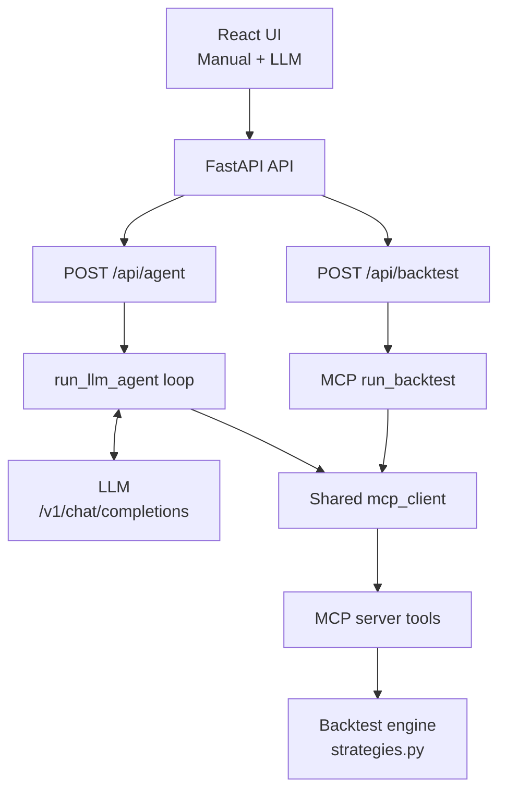

# Building an MCP-Centered Quant Strategy Lab with Manual and LLM Modes

We built this quant strategy lab to experiment with MCP server integration across Manual and LLM workflows, so we can compare LLM output with manual workflow output.

MCP is treated as the execution boundary for strategy operations, so both human-driven and LLM-driven workflows can reach the same backtest path. The web app, the manual client wrapper, and the LLM loop are all interface layers around a shared MCP contract rather than separate execution engines.

## Why MCP Is the Center of the Design

At code level, the architecture has a clear chain. The core strategy engine lives in `src/mcp_quant/strategies.py`. The MCP tool surface lives in `src/mcp_quant/mcp_server.py`. Transport, session health, and retries live in `src/mcp_quant/mcp_client.py`. Finally, the interface entry point lives in `src/mcp_quant/web/app.py`, with UI interactions in `src/mcp_quant/web/static/app.jsx`.

Because backtest operations flow through MCP, strategy logic is not duplicated across modes. Built-in strategies such as `sma_crossover`, `rsi_reversion`, and `channel_breakout` remain defined once in the engine and consumed through one tool contract.

## Runtime Architecture

Note: Medium does not render Mermaid directly. Export diagrams as PNG/SVG before publishing.



## MCP Client Lifecycle in the API Process

The FastAPI process opens one MCP connection at startup and closes it at shutdown. In practice, this is important because both Manual and LLM modes use the same persistent session, which avoids reconnect overhead and keeps retry/health behavior centralized in one place.

```python
@app.on_event("startup")
async def startup_mcp() -> None:
    await mcp_client.connect()

@app.on_event("shutdown")
async def shutdown_mcp() -> None:
    await mcp_client.close()
```

By default, this session talks to the MCP server over stdio (`python -m mcp_quant.mcp_server`). If `MCP_SERVER_URL` is set and SSE support is available, the same client can switch to SSE transport.

## Manual Mode Flow Through MCP

Manual mode (`POST /api/backtest`) chooses a data source branch before execution. Depending on input, prices are fetched directly with `fetch_yahoo_prices` or requested via MCP `sample_price_series`.

After data is available, the execution path converges to MCP `run_backtest` through `manual_client.run_backtest`. This is the core consistency point: regardless of source data, strategy execution and metrics are produced by the same MCP-backed engine call.


## LLM Mode as an MCP Orchestration Loop

LLM mode (`POST /api/agent`) calls `run_llm_agent`, which repeatedly requests JSON actions from an OpenAI-compatible `/v1/chat/completions` endpoint. Each tool action is executed through `mcp_client.call_mcp_tool`, and non-terminal tool results are fed back into the loop as conversational context.

The loop behavior is implementation-specific and deterministic in two important ways. First, strategy names in `run_backtest.strategy` and `get_strategy_schema.name` are resolved before tool execution using normalization, aliases, compact matching, and fuzzy matching. Second, when the selected tool is `run_backtest`, the function returns immediately with `{"final": "Tool executed.", "steps": ...}`. If the model provides `{"final": ...}` first, that final is returned. If neither terminal condition is reached, the loop ends at step limit.

## MCP Tool Contract and Thin Server Pattern

The MCP tool surface currently exposes `list_strategies`, `get_strategy_schema`, `sample_price_series`, `fetch_yahoo_prices`, and `run_backtest`. The important design choice is that `run_backtest` in `mcp_server.py` remains thin and delegates core logic to engine functions in `strategies.py`.

```python
cleaned = validate_prices(prices)
signals = generate_signals(cleaned, strategy, params)
result = backtest(cleaned, signals, start_cash=start_cash, fee_bps=fee_bps)
return {"prices": cleaned, "signals": signals, **result}
```

This keeps the tool contract stable while letting the strategy engine evolve independently.

## How the UI Reflects Executed MCP State

The UI intentionally ties visualization updates to explicit execution events instead of input changes. In both tabs, charts update only when the user clicks `Run backtest`. After a successful run, the corresponding run button is disabled and grayed out. Any parameter or input change re-enables that button, signaling that current chart state is stale relative to current inputs. This creates a clean boundary between editing state and executed state.

## Extending the Project Without Breaking the Contract

Adding a strategy is straightforward: define a new `StrategySpec`, wire new signal logic into `generate_signals()`, add any needed validation, and extend tests. In most cases you do not need new endpoints, because the existing MCP `run_backtest` contract already handles execution.

## Closing Thoughts

The most useful outcome of this architecture is not merely MCP adoption; it is operational clarity. One execution core, one MCP contract, and one shared transport/session allow two interaction styles, manual and agentic, without architectural drift.
